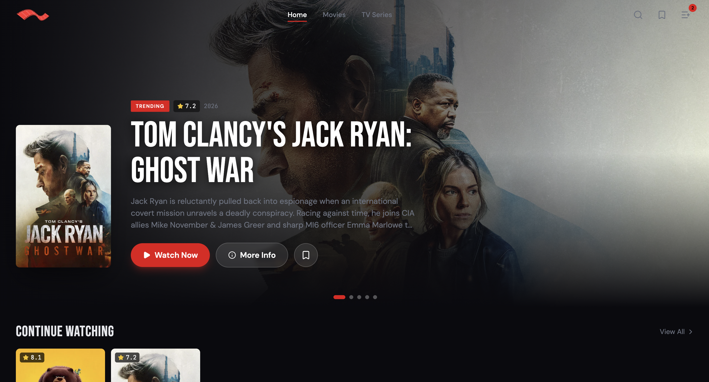

# 🎬 FreeKyi (CinemaFlow)

FreeKyi is a premium web application for browsing and streaming movies and TV series. Built with a sleek dark-mode interface, fluid animations, and highly optimized performance.

## 📷 Screenshots

This repo already includes screenshots. The README now references the existing images in `public/`:

- [Desktop screenshot](public/desktop_screenshot.png)

Embedded previews:

## ✨ Features

- **Extensive Catalog:** Browse trending, top-rated, and genre-specific movies and TV shows.
- **Embedded Streaming:** Watch movies and episodes directly in the app.
- **Advanced Search:** Real-time debounced search with categorized tabs (All, Movies, TV).
- **Bookmarks:** Save your favorite shows and movies to watch later (persisted locally).
- **Responsive UI:** Fully optimized for both desktop and mobile screens, including mobile bottom-sheet filters and tailored pagination.
- **Top-Tier Performance:** Implements lazy loading, JavaScript chunking, and pre-connected API routes.

## 🛠 Tech Stack

- **Framework:** React 19 + TypeScript
- **State Management:** Redux Toolkit
- **Routing:** React Router DOM
- **Styling:** Tailwind CSS + Framer Motion (for smooth animations)
- **Data Source:** [TMDB (The Movie Database) API](https://www.themoviedb.org/)
- **Build Tool:** Vite

## 🚀 Getting Started

### Prerequisites

Make sure you have [Node.js](https://nodejs.org/) installed.

### 1. Clone the repository

\`\`\`bash
git clone https://github.com/your-username/cinemaflow.git
cd cinemaflow
\`\`\`

### 2. Install dependencies

\`\`\`bash
npm install
\`\`\`

### 3. Environment Setup

Create a \`.env\` file in the root of the project and add your TMDB API keys:
\`\`\`env
VITE_BASE_URL=https://api.themoviedb.org/3
VITE_MOVIE_APIKEY=your_tmdb_v3_api_key_here
VITE_VIDEO_SERVER_1_NAME=VidAPI
VITE_VIDEO_SERVER_1_URL=https://vaplayer.ru
VITE_VIDEO_NAME=Server 2
VITE_VIDEO_URL=https://your-primary-authorized-embed-provider.example
VITE_VIDEO_SERVER_3_NAME=VidFast
VITE_VIDEO_SERVER_3_URL=https://www.vidfast.net
\`\`\`
*(You can get a free API key by signing up at [TMDB's Developer Portal](https://developer.themoviedb.org/docs)).\_

Optional extra video servers can be configured with URL templates. The app
can build standard path-style embed URLs from a single base URL:

\`\`\`env
VITE_VIDEO_SERVER_1_NAME=VidAPI
VITE_VIDEO_SERVER_1_URL=https://vaplayer.ru
\`\`\`

That creates for embed providers:

\`\`\`text
Movie: /embed/movie/{id}
TV:    /embed/tv/{id}/{season}/{episode}
\`\`\`

VidFast uses direct player paths instead:

\`\`\`text
Movie: /movie/{id}
TV:    /tv/{id}/{season}/{episode}
\`\`\`

If a provider uses a different URL shape, use templates instead. Templates
support `{id}` or `{tmdb}`, `{season}`, and `{episode}` placeholders:

\`\`\`env
VITE_VIDEO_SERVER_3_NAME=Custom Server
VITE_VIDEO_SERVER_3_MOVIE_URL=https://your-authorized-provider.example/movie/{id}
VITE_VIDEO_SERVER_3_TV_URL=https://your-authorized-provider.example/tv/{id}/{season}/{episode}
\`\`\`

### 4. Run the Development Server

\`\`\`bash
npm run dev
\`\`\`
Open [http://localhost:5173](http://localhost:5173) to view it in the browser.

### 5. Build for Production

\`\`\`bash
npm run build
\`\`\`

## ⚠️ Disclaimer

- This application does not host any media files on its own servers.
- All metadata, posters, and backdrops are provided by [TMDB](https://www.themoviedb.org/).
- Video playback relies on third-party public iframe endpoints that are not affiliated with this project. Use at your own discretion.
